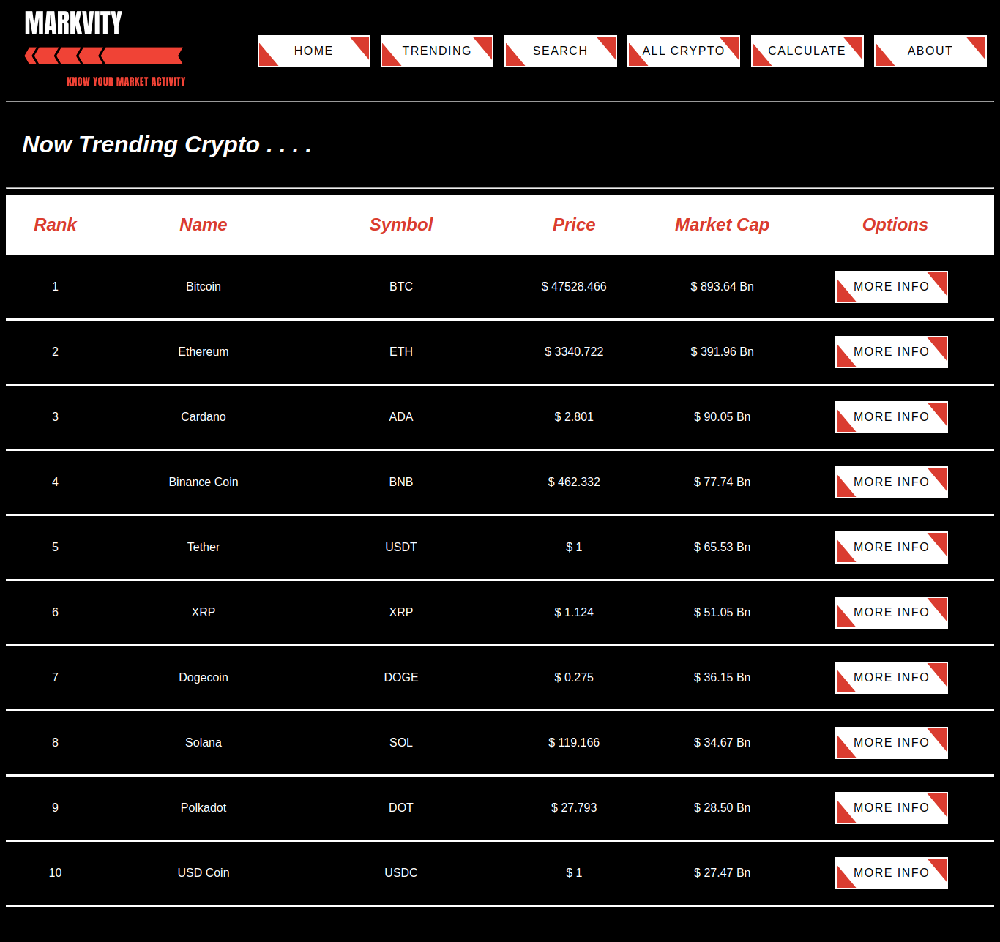
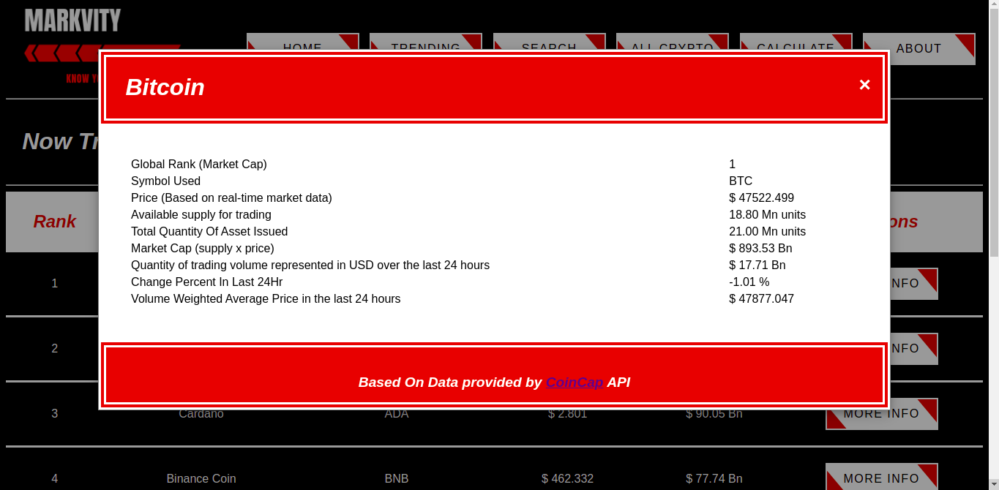
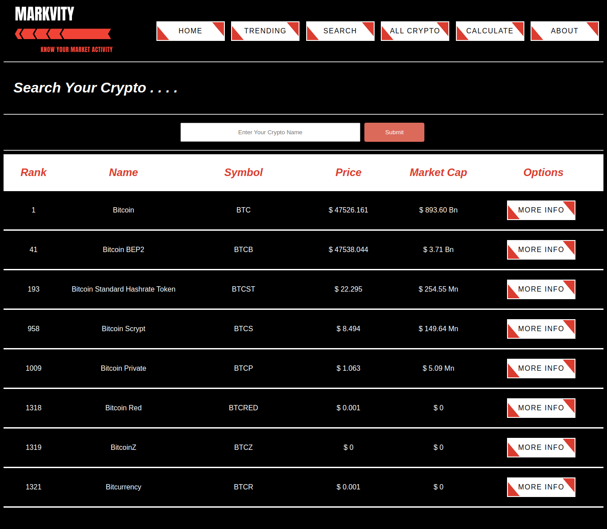
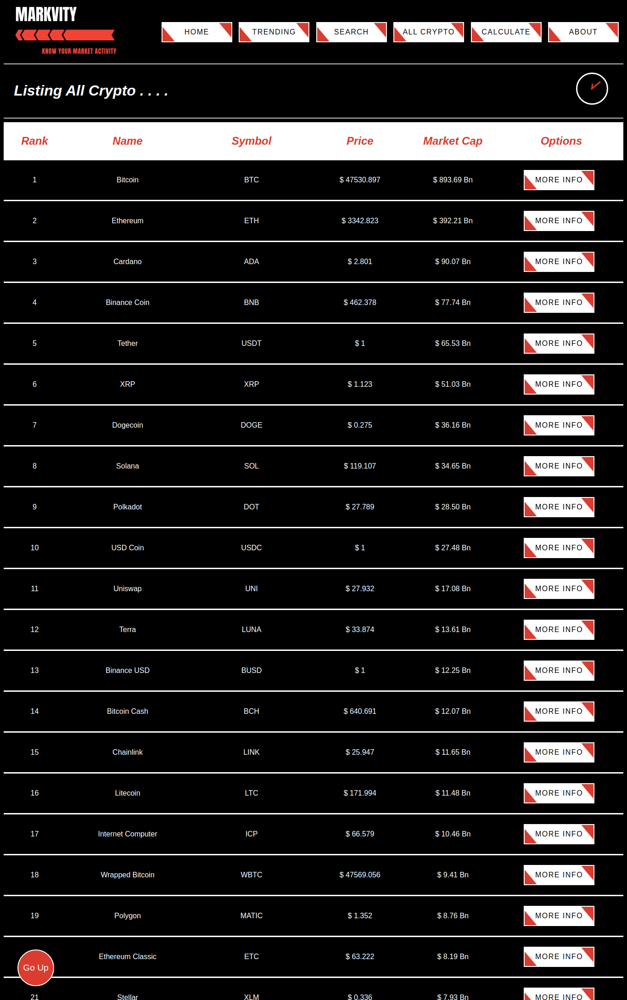
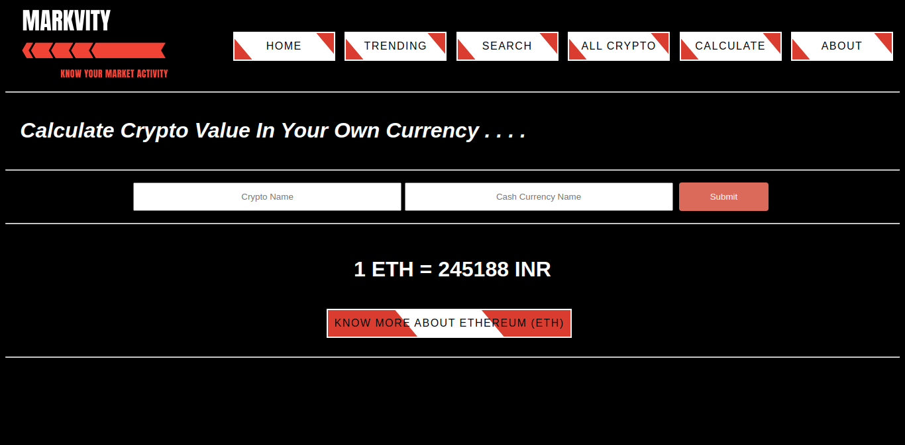
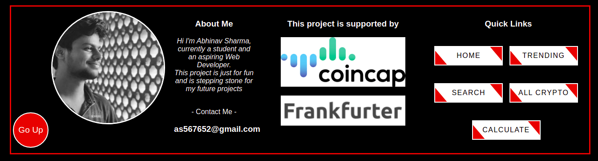

# MArKVity (Know Your Market Activity)

An API based Web App, which will display market activity for your cryptocurrency.


## Table of contents
* [Introduction](#introduction)
* [Features](#features)
* [Technologies](#technologies)
* [Setup](#setup)
* [Launch](#launch)
* [Illustrations](#illustrations)
* [Status](#status)
* [Sources](#sources)
* [Other](#other)


## Introduction
In current world, everyone knows how important cryptocurrency is. This webapp helps in limiting the gap between constantly changing world of cryptocurrency and a person who wants to keep herself/himself updated.
<br>
<br>
This project is supported by 2 independents and reliable APIs that are :-
* [Coincap](https://docs.coincap.io/)
* [Frankfurter](https://www.frankfurter.app/)


## Features
* Narly 2000 different cryptos are listed.
* Interactive and stylized web design for smooth and better user experience.
* Data shown is fetched on the moment to keep user updated all the time.
* Currency coversions rates are also fetched on the moment.
* For better experience different oprions has been provide like **Trending Cryptos**, **All Cryptos**, **Conversions** etc.


## Technologies
  #### Software Used :
  * VS Code : 1.58.2
  #### Languages Used :
  * Python 3
  * HTML
  * CSS
  * JavaScript
  #### Frameworks Used :
  * Django : 3.1.7
  #### Project Tested On :
   * Brave Web Browser  : Version 1.28.106 Chromium: 92.0.4 (Official Build) (64-bit)


## Setup
First you must have these softwares and languages installed on your system -
  * [Python 3](https://www.python.org/)
  * [Django : 3.1.7](https://docs.djangoproject.com/en/3.2/topics/install/)
  * Web Browser

Important Note :- 
If getting CORS error on loading install [Allow CORS: Access-Control-Allow-Origin Chrome Extension](https://chrome.google.com/webstore/detail/allow-cors-access-control/lhobafahddgcelffkeicbaginigeejlf) or equivalent web extension

## Launch
To run this project, run these commands in terminal. Make sure that manage.py file is present in the current directory
```
$ python3 manage.py makemigrations
$ python manage.py migrate
$ python manage.py runserver
```
Project will be availaible on address **http://127.0.0.1:8000/**

Note :- For Admin Access First You need to Create Super User using Command
```
$ python3 manage.py createsuperuser
```
Admin panel can be accessed at **http://127.0.0.1:8000/admin** after running the server


## Illustrations

### HomePage
<p align="left">
  
</p>

### Trending Page
<p align="left">
  
</p>

### More Info About A Crypto
<p align="left">
  
</p>

### Search Your Crypro
<p align="left">
  
</p>

### List All Crypto
<p align="left">
  
</p>

### Convert Crypto To Currency Of Your Choice
<p align="left">
  
</p>

### About Me
<p align="left">
  
</p>


## Project status
  ***Completed***
  (Improvements Needed)


## Sources
  * [**Django Documentation**](https://docs.djangoproject.com/en/3.2/)
  * Images used in this project may be subject to copyright.
  * [Coincap API Documentation](https://docs.coincap.io/)
  * [Frankfurter API Documentation](https://www.frankfurter.app/docs/)
  

## Other
  This Project was created by Abhinav Sharma. This project is made for fun, and is stepping stone for my future projects.

